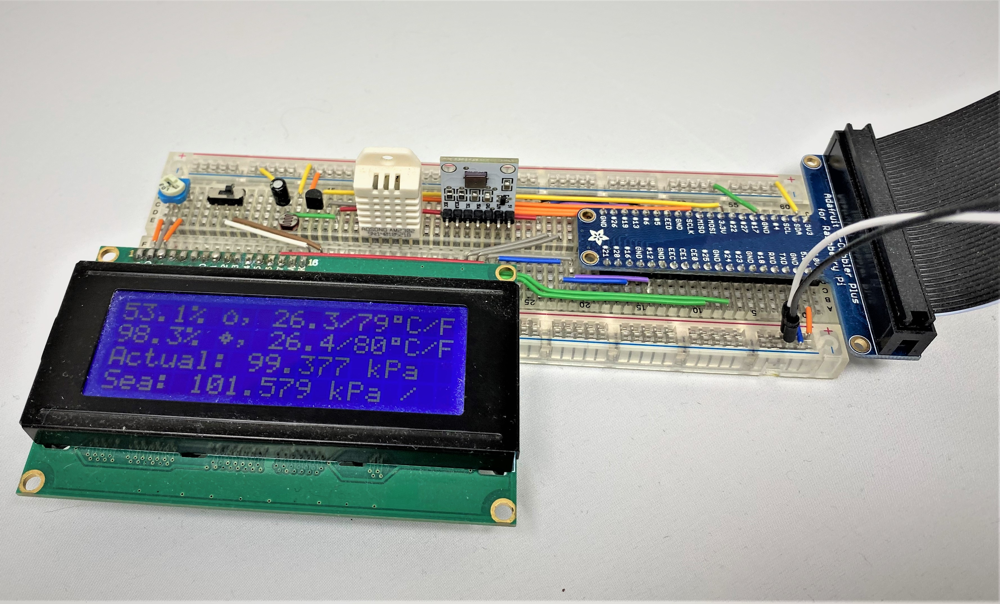

# Raspberry Pi Weather Station

Indoor weather station built for continuous operation on a Raspberry Pi 4 (4GB). Uses 3 Sensors;

- BMP-085 for temperature and pressure (both measured and adjusted for the know sea level at the location the station is deployed)
- DHT-22 for temperature and humidty
- Light dependent resistor for light level (charge_time_limit=0.1 and multiplied by 100 : semi-normalized to the room lighting)

This data is printed to an LCD screen using a few custom characters for better stylization; to make the display both dense and informative. There is also a custom message function that can be used to add the occasional "I love you" to the LCD for a significant other or the like.

As well as being printed out, the data is logged into an InfluxDB instance running locally on the pi. This allows for some fun visualization in Graphana!

## Installs

### Needed for InfluxDB;

    pip install influxdb-client

Also needs an Influx instance running locally so see setting up [InfluxDB on a Pi](https://pimylifeup.com/raspberry-pi-influxdb/) for more.

### 'Needed' for the various connections from the Raspberry Pi to the station;

    pip install Adafruit-BMP
    pip install adafruit-circuitpython-dht
    pip install adafruit-python-shell
    pip install gpiozero
    pip install RPi.GPIO
    pip install RPLCD

Check [this link on circuitpython](https://learn.adafruit.com/circuitpython-on-raspberrypi-linux/installing-circuitpython-on-raspberry-pi) for more about the setup needed for this library.

## Continuous operation

The `.service` and `.timer` files are for systemd. They start up the python script after the pi turns on, and restart it if there is an error.
